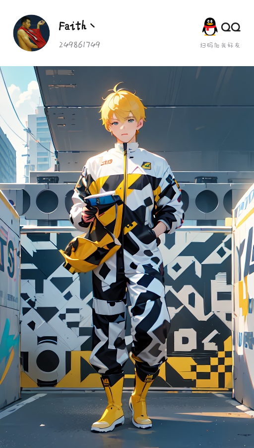

# 冉暖科技官网 — 升级改造接口契约（冻结版 v1）

> 本文件是并行改造的唯一事实来源。所有执行者**必须**严格遵守。
> 契约一旦冻结，**不得**单方面修改；如发现契约本身有缺陷，向 Lead 报告，由 Lead 统一修订并广播。

---

## 0. 背景：本次改造必须解决的既有缺陷

改造前代码审计结论（已确认，非推测）：

| # | 缺陷 | 证据 | 影响 |
|---|------|------|------|
| B1 | `js/enhanced-effects.js` 调用 `window.addListener(...)`（不存在的方法），在 `DOMContentLoaded` 中**抛出 TypeError**，中断同函数后续全部调用 | `js/enhanced-effects.js:99` | 滚动进度条、鼠标光晕、粒子拖尾、3D 倾斜、视差、标题字符动画、产品页 Hero 粒子、按钮光斑 **全部失效**（约 90% 的特效层是死代码） |
| B2 | `js/scifi-animations.js` 中 `el.querySelector('::after')` 是非法选择器，在 `mousemove` 中**抛 DOMException** | `js/scifi-animations.js:263` | 鼠标滑过任意 `.card-glow-track` 卡片即刷屏报错；且 CSS 从未消费 `--glow-x/--glow-y`，光晕不会跟随鼠标 |
| B3 | `js/scifi-animations.js` 用 `card.innerHTML` 把卡片内容包进 `.card-3d-inner` | `js/scifi-animations.js:102-108` | 与 `js/home.js` 的 `init3DCards()` 同时给同一卡片写 transform，**双重 3D 倾斜互相打架** |
| B4 | `js/home.js` 的 `initTitleChars()` 用 `line.textContent` 重建 `innerHTML` | `js/home.js:368-387` | 把 `<span class="highlight">` 抹平，首页主标题的**渐变文字效果丢失** |
| B5 | `js/home.js` 的 `initCounter()` 查 `[data-count]`，而 `index.html` 用的是 `.counter[data-target]` | `js/home.js:332` vs `index.html:102` | 该函数永远不执行，属死代码 |
| B6 | `.counter` 实际由 `js/scifi-animations.js` 驱动，但它只写 `textContent = 数字` | `js/scifi-animations.js:351` | `data-suffix="+"` / `"%+"` **被丢弃**，首页数据栏显示 "10" 而非 "10+"、"80" 而非 "80%+" |
| B7 | 全站图片、图标使用绝对路径 `/assets/...` | 全部 HTML | 部署到 GitHub Pages 子路径（`/<repo>/`）时**全部 404**；README 明确宣传 GitHub Pages 部署方式 |
| B8 | `pricing.html` / `privacy.html` / `terms.html` 是遗留孤立页 | `pricing.html:17`、`privacy.html:16`、`terms.html:17` | 自带内联 CSS + **蓝色主题**（`--primary:#3498db`），与品牌暖琥珀色系完全脱节；**不加载 `css/style.css`**、**不加载 `js/main.js`**；弹窗用 `.wechat-modal` 而非 `.modal-overlay`；无导航栏/面包屑/返回顶部 |
| B9 | `css/scifi-effects.css` 与 `css/home.css` 同时定义全局 `.fluid-blob` | `scifi-effects.css:20` vs `home.css:597` | 首页轮播背景 blob 与全站背景 blob 规则互相污染 |
| B10 | `.showcase-track` 内 `.product-showcase` 同时命中 `home.css` 的 `.product-showcase::before` 与 `scifi-effects.css` 的 `.card-3d-enhanced::before` | 两文件 | 同一伪元素被两套规则抢写，圆锥渐变描边动画实际已被覆盖 |
| B11 | `music.html` 约 1500 行 CSS 内联在 `<style>` 中 | `music.html:1-1520` | 不可缓存、无法复用、首屏阻塞 |
| B12 | `epos_dump.html` 是 `epos.html` 的重复转储副本，无任何页面链接 | 全站 grep | 垃圾文件，污染 SEO 与仓库 |
| B13 | 无 `robots.txt` / `sitemap.xml` / `404.html` / `site.webmanifest` / OG / Twitter Card / canonical / JSON-LD | 全站 | 分享无卡片、SEO 弱、抓取无指引 |
| B14 | 弹窗无 `role="dialog"` / `aria-modal` / 焦点陷阱；汉堡按钮无 `aria-expanded`；移动菜单无 ESC 关闭 | 全站 | 键盘与读屏用户无法正常使用 |
| B15 | `.card-4`（TV 卡片）缺少 `.card-icon` 配色规则 | `home.css:441-443` 只有 card-1/2/3 | TV 卡片图标无背景色 |
| B16 | HTML 标签未闭合：`faq.html:90`、`changelog.html:157`、`roadmap.html:120` 的 `.footer-inner` 缺 `</div>`；`terms.html:326` 的 `.container` 缺 `</div>` | `<div` vs `</div>` 计数差 1 | DOM 结构错乱，浏览器容错解析但语义地标嵌套错误 |
| B17 | `pricing.html` 有 4 个 `href="#"` 占位链接（1420/1421/1428/1429，指向 tutorials/faq/changelog/roadmap，这些页面都存在）与一个畸形链接 `<a href="mailto:.com">`（1332） | 审计确认 | 死链接 + 邮箱链接失效 |
| B18 | `faq.html` 只有 `mobileMenu` / `main` 两个 id，但 `order.html`/`music.html`/`epos.html` 深链到 `faq.html#order` / `#music` / `#epos` | 审计确认 | 跨页深链全部落到页首 |
| B19 | `changelog.html:180-188` 有内联 `<script>` 实现 `filterLog()`；`pricing.html:1446-1626`、`privacy.html:387-432`、`terms.html:392-437` 各有大段内联 `<script>` | 审计确认 | 不可缓存、与 main.js 职责重复、违反契约"零内联 script" |

---

## 1. 最终资源清单（冻结）

```
css/
  style.css      # 设计令牌 + 重置 + 排版 + 通用组件（按钮/导航/页脚/弹窗/区块/显露/返回顶部/工具类）
  home.css       # 仅首页
  product.css    # 仅产品页（order / music / epos / tv）
  pages.css      # 内容页（tutorials / faq / changelog / roadmap）
  legal.css      # 价格与条款页（pricing / privacy / terms）— 由原来的内联 CSS 抽出
  effects.css    # 全站特效层（合并原 scifi-effects.css + enhanced-effects.css）
js/
  main.js        # 核心运行时
  effects.js     # 特效引擎（合并原 scifi-animations.js + enhanced-effects.js）
  home.js        # 仅首页（Hero Canvas + 3D 卡片）
  pages.js       # 仅内容页（内容筛选 / 目录高亮等页面级交互，按需加载）
  product.js     # 仅产品页（网盘密码解锁等页面级交互，按需加载）
```

**将删除（Lead 在所有页面停止引用后执行，执行者不要自行删除）**：
`css/scifi-effects.css`、`css/enhanced-effects.css`、`js/scifi-animations.js`、`js/enhanced-effects.js`、`epos_dump.html`

---

## 2. 每个页面 `<head>` 的固定结构

```html
<!DOCTYPE html>
<html lang="zh-CN">
<head>
<meta charset="UTF-8">
<meta name="viewport" content="width=device-width, initial-scale=1.0, viewport-fit=cover">
<meta name="theme-color" content="#D4943A">

<!-- 每页唯一：title / description / keywords / canonical / og / twitter -->
<title>…</title>
<meta name="description" content="…">
<meta name="keywords" content="…">
<link rel="canonical" href="https://ranuan.netlify.app/xxx.html">

<meta property="og:type" content="website">
<meta property="og:site_name" content="冉暖科技 RanNuan Tech">
<meta property="og:locale" content="zh_CN">
<meta property="og:title" content="…">
<meta property="og:description" content="…">
<meta property="og:url" content="https://ranuan.netlify.app/xxx.html">
<meta property="og:image" content="https://ranuan.netlify.app/assets/music/universe.png">
<meta name="twitter:card" content="summary_large_image">
<meta name="twitter:title" content="…">
<meta name="twitter:description" content="…">
<meta name="twitter:image" content="https://ranuan.netlify.app/assets/music/universe.png">

<link rel="icon" href="assets/logo.ico" sizes="any">
<link rel="apple-touch-icon" href="assets/logo.ico">
<link rel="manifest" href="site.webmanifest">

<link rel="preconnect" href="https://fonts.googleapis.com">
<link rel="preconnect" href="https://fonts.gstatic.com" crossorigin>
<link rel="preconnect" href="https://cdn.jsdelivr.net" crossorigin>
<link rel="stylesheet" href="https://fonts.googleapis.com/css2?family=Syne:wght@600;700;800&family=DM+Sans:ital,wght@0,400;0,500;0,600;0,700;1,400&family=Noto+Sans+SC:wght@400;500;700&display=swap">
<link rel="stylesheet" href="https://cdn.jsdelivr.net/npm/@fortawesome/fontawesome-free@6.4.0/css/all.min.css" crossorigin="anonymous" referrerpolicy="no-referrer">

<link rel="stylesheet" href="css/style.css">
<!-- 页面专属：下面三选一 -->
<link rel="stylesheet" href="css/home.css">     <!-- 仅 index -->
<link rel="stylesheet" href="css/product.css">  <!-- 仅 order/music/epos/tv -->
<link rel="stylesheet" href="css/pages.css">    <!-- 仅 tutorials/faq/changelog/roadmap -->
<link rel="stylesheet" href="css/legal.css">    <!-- 仅 pricing/privacy/terms -->
<!-- 全站最后 -->
<link rel="stylesheet" href="css/effects.css">
</head>
```

**硬性要求**
- 所有本地资源路径**必须相对**（`assets/...`、`css/...`、`js/...`），**禁止**以 `/` 开头。**B7**
- 字体权重已收敛为：Syne `600;700;800`；DM Sans `400;500;600;700` + 斜体 400；Noto Sans SC `400;500;700`。**不要**改回 5 个 CJK 字重。
- `<style>` 内联块**最多保留 3 行以内**的页面级微调；其余全部移入对应 CSS 文件。**B11**
- 每页 `<head>` 末尾追加该页专属 JSON-LD（见 §7）。

> **og:image 说明（Lead 决定，勿改）**：本环境无法生成新的二进制图片，`assets/og-cover.png` **并不存在**。
> 全站 `og:image` / `twitter:image` 统一使用**已存在**的 `https://ranuan.netlify.app/assets/music/universe.png`（1375×1000，品牌旗舰「3D 宇宙相册」截图，深色+暖色基调与品牌一致）。
> **不要**引用 `assets/og-cover.png` 或任何不存在的图片路径。

> **`404.html` 的路径例外（唯一豁免，勿模仿）**：错误页会被服务器在**任意深度**的路径上返回，因此相对路径必然解析错误。
> `404.html`（由 Lead 独占维护）**使用根绝对路径** `/css/...`、`/js/...`、`/assets/...`，这是刻意的、唯一的例外。
> 除 `404.html` 外的**所有** HTML 必须使用相对路径。验证者在做"零绝对路径"检查时，应把 `404.html` 排除。

---

## 3. 脚本加载（全部页面，位于 `</body>` 之前，顺序固定）

```html
<script src="js/main.js"></script>
<script src="js/effects.js"></script>
<!-- 仅 index.html 追加： -->
<script src="js/home.js"></script>
<!-- 仅 content-pages 作用域内、确有页面级交互的页面追加： -->
<script src="js/pages.js"></script>
<!-- 仅 product-pages 作用域内、确有页面级交互的页面追加： -->
<script src="js/product.js"></script>
```

- **禁止**再引用 `js/scifi-animations.js` / `js/enhanced-effects.js`。**B1 B2 B3**
- **禁止**新增内联 `<script>`（JSON-LD 的 `<script type="application/ld+json">` 不受此限）。**B19**
- `js/main.js` 与 `js/effects.js` 必须能容忍自身被重复加载（内部 IIFE + 重复初始化守卫）。

---

## 4. 共享组件标记（冻结，逐字复制，只允许改 `data-page` 与高亮项）

### 4.1 `<body>`
```html
<body data-page="home">
```
`data-page` 取值（唯一）：`home` `order` `music` `epos` `tv` `pricing` `tutorials` `faq` `changelog` `roadmap` `privacy` `terms`
（额外保留值：`404` —— 仅供 Lead 维护的 `404.html` 使用，该页无对应导航项，`main.js` 不会设置任何 `.active`。）

### 4.2 跳转链接 + 主导航
```html
<a href="#main" class="skip-link">跳转到主要内容</a>

<nav class="nav" id="nav" aria-label="主导航">
    <div class="nav-inner">
        <a href="index.html" class="nav-logo" aria-label="冉暖科技首页">
            
            <span class="logo-text">冉暖科技</span>
        </a>
        <ul class="nav-links">
            <li><a href="order.html" data-nav="order">冉暖订货系统</a></li>
            <li><a href="music.html" data-nav="music">冉暖音乐播放器</a></li>
            <li><a href="epos.html" data-nav="epos">冉暖收银系统</a></li>
            <li><a href="tv.html" data-nav="tv">冉暖视频播放器</a></li>
            <li><a href="pricing.html" data-nav="pricing">价格方案</a></li>
            <li><a href="index.html#about">关于</a></li>
            <li><a href="index.html#contact">联系</a></li>
        </ul>
        <div class="nav-cta">
            <a href="index.html#contact" class="btn btn-primary btn-sm"><i class="fas fa-paw" aria-hidden="true"></i> 咨询合作</a>
        </div>
        <button class="mobile-menu-btn" type="button" aria-label="打开菜单" aria-expanded="false" aria-controls="mobileMenu" data-menu-toggle>
            <span></span><span></span><span></span>
        </button>
    </div>
</nav>
```

### 4.3 移动菜单
```html
<div class="mobile-menu" id="mobileMenu">
    <button class="mobile-menu-close" type="button" aria-label="关闭菜单" data-menu-toggle><i class="fas fa-times" aria-hidden="true"></i></button>
    <a href="order.html">冉暖订货系统</a>
    <a href="music.html">冉暖音乐播放器</a>
    <a href="epos.html">冉暖收银系统</a>
    <a href="tv.html">冉暖视频播放器</a>
    <a href="pricing.html">价格方案</a>
    <a href="index.html#about">关于</a>
    <a href="index.html#contact">联系</a>
</div>
```
> 键盘可达性依赖 CSS 的 `visibility: hidden`，**不要**加 `aria-hidden`（会与内部可聚焦元素冲突）。

### 4.4 主内容区
每页必须有一个 `<main id="main">` 包裹全部主内容（导航与页脚之外），供 skip-link 与读屏地标使用。

### 4.5 页脚（逐字一致）
```html
<footer class="footer">
    <div class="footer-inner">
        <div class="footer-top">
            <div class="footer-brand">
                <a href="index.html" class="nav-logo" aria-label="冉暖科技首页"><span class="logo-text">冉暖科技</span></a>
                <p>用技术创造温暖。专注鞋服零售、视频娱乐平台与音乐领域的软件开发团队。</p>
                <div class="footer-social">
                    <a href="#" data-modal-open="wechat" aria-label="微信"><i class="fab fa-weixin" aria-hidden="true"></i></a>
                    <a href="#" data-modal-open="qq" aria-label="QQ"><i class="fab fa-qq" aria-hidden="true"></i></a>
                    <a href="mailto:aaronwei97@qq.com" aria-label="邮箱"><i class="fas fa-envelope" aria-hidden="true"></i></a>
                </div>
            </div>
            <div class="footer-column"><h4>产品</h4><ul>
                <li><a href="order.html">冉暖订货系统</a></li>
                <li><a href="music.html">冉暖音乐播放器</a></li>
                <li><a href="epos.html">冉暖收银系统</a></li>
                <li><a href="tv.html">冉暖视频播放器</a></li>
            </ul></div>
            <div class="footer-column"><h4>帮助支持</h4><ul>
                <li><a href="index.html#contact">联系我们</a></li>
                <li><a href="pricing.html">价格方案</a></li>
                <li><a href="tutorials.html">使用教程</a></li>
                <li><a href="faq.html">常见问题</a></li>
            </ul></div>
            <div class="footer-column"><h4>了解更多</h4><ul>
                <li><a href="index.html#about">关于我们</a></li>
                <li><a href="changelog.html">更新日志</a></li>
                <li><a href="roadmap.html">功能路线图</a></li>
            </ul></div>
        </div>
        <div class="footer-bottom">
            <p>&copy; 2025 冉暖科技 RanNuan Tech <i class="fas fa-paw" aria-hidden="true"></i></p>
            <div class="footer-bottom-links"><a href="privacy.html">隐私政策</a><a href="terms.html">使用条款</a></div>
        </div>
    </div>
</footer>

<button class="back-to-top" type="button" aria-label="返回顶部"><i class="fas fa-chevron-up" aria-hidden="true"></i></button>
```

### 4.6 弹窗（两个，逐字一致，放在 `</footer>` 之后）
```html
<div class="modal-overlay" id="wechatModal" data-modal="wechat">
    <div class="modal-content" role="dialog" aria-modal="true" aria-labelledby="wechatModalTitle">
        <button class="modal-close" type="button" aria-label="关闭" data-modal-close><i class="fas fa-times" aria-hidden="true"></i></button>
        <div class="modal-icon modal-icon-wechat"><i class="fab fa-weixin" aria-hidden="true"></i></div>
        <h3 id="wechatModalTitle">添加开发者微信</h3>
        <p class="modal-sub">获取试用名额 · 技术支持 · 交流反馈</p>
        <div class="modal-qr"></div>
        <div class="modal-id">
            <span class="modal-id-label">微信号:</span>
            <span id="wechatIdText" class="modal-id-value">AaronWei24</span>
            <button class="copy-btn" type="button" data-copy="#wechatIdText">复制</button>
        </div>
        <p class="modal-tip">添加请注明：<span>冉暖科技咨询</span></p>
    </div>
</div>

<div class="modal-overlay" id="qqModal" data-modal="qq">
    <div class="modal-content" role="dialog" aria-modal="true" aria-labelledby="qqModalTitle">
        <button class="modal-close" type="button" aria-label="关闭" data-modal-close><i class="fas fa-times" aria-hidden="true"></i></button>
        <div class="modal-icon modal-icon-qq"><i class="fab fa-qq" aria-hidden="true"></i></div>
        <h3 id="qqModalTitle">添加开发者QQ</h3>
        <p class="modal-sub">在线咨询 · 远程协助 · 问题反馈</p>
        <div class="modal-qr"></div>
        <div class="modal-cta"><a href="tencent://message/?uin=249861749&amp;Site=Sambow&amp;Menu=yes" class="btn btn-primary btn-sm"><i class="fab fa-qq" aria-hidden="true"></i> 点击发起聊天</a></div>
        <div class="modal-id">
            <span class="modal-id-label">QQ号:</span>
            <span id="qqIdText" class="modal-id-value">249861749</span>
            <button class="copy-btn copy-btn-qq" type="button" data-copy="#qqIdText">复制</button>
        </div>
        <p class="modal-tip">添加请注明：<span class="modal-tip-qq">冉暖科技咨询</span></p>
    </div>
</div>
```

---

## 5. 数据属性契约（JS 只认这些钩子）

| 属性 | 位置 | 语义 |
|------|------|------|
| `data-page="…"` | `<body>` | 当前页面标识，`main.js` 据此设置导航 `.active` + `aria-current="page"` |
| `data-nav="…"` | 主导航 `<a>` | 与 `data-page` 匹配 |
| `data-menu-toggle` | 汉堡按钮 / 关闭按钮 | 切换移动菜单 |
| `data-modal-open="wechat\|qq"` | 任意元素 | 打开对应弹窗 |
| `data-modal-close` | 弹窗关闭按钮 | 关闭所在弹窗 |
| `data-modal="wechat\|qq"` | `.modal-overlay` | 标识弹窗身份 |
| `data-copy="#selector"` | `.copy-btn` | 复制目标元素文本 |
| `data-counter="3"` + `data-counter-suffix="+"` | 计数元素 | 滚动进入视口后递增 |
| `data-tilt="6"` | 任意卡片 | 3D 倾斜最大角度（度） |
| `data-speed="0.15"` | 任意元素 | 视差速率 |
| `data-reveal-delay="2"` | 与 `.reveal` 同用 | 级联延迟档位 1–5（等价于 `.delay-N`） |
| `data-lazy-bg="assets/x.png"` | 任意元素 | 进入视口后才设置 `background-image` |

**禁用**：`onclick=` / `onerror=` 内联事件（改造范围内的页面必须清零）。
`javascript:void(0)` 也一并清除 —— 改用 `<a href="#" data-modal-open="…">` 或 `<button type="button">`。

---

## 6. CSS 类名契约（`css/style.css` 必须提供）

`style.css` 是共享底座，**必须**定义下列全部类；页面执行者可以依赖它们存在：

- 布局：`.section`（含 `.section-header` `.section-badge` `.section-title` `.section-subtitle`）、`.container`
- 按钮：`.btn` `.btn-primary` `.btn-accent` `.btn-outline` `.btn-ghost` `.btn-sm` `.btn-lg`
- 导航：`.nav` `.nav-inner` `.nav-logo` `.logo-text` `.nav-links` `.nav-cta` `.mobile-menu-btn` `.mobile-menu` `.mobile-menu-close`
- 页脚：`.footer` `.footer-inner` `.footer-top` `.footer-brand` `.footer-social` `.footer-column` `.footer-bottom` `.footer-bottom-links`
- 弹窗：`.modal-overlay` `.modal-content` `.modal-close` `.modal-icon` `.modal-icon-wechat` `.modal-icon-qq` `.modal-qr` `.modal-id` `.modal-id-label` `.modal-id-value` `.modal-cta` `.modal-tip` `.modal-sub` `.copy-btn` `.copy-btn-qq`
- 显露动画：`.reveal` `.reveal-left` `.reveal-right` `.reveal-scale` `.delay-1`…`.delay-5`，激活类为 **`.visible`**
- 其他：`.skip-link` `.back-to-top`

**`css/effects.css` 命名空间规则（重要）**
- 所有类以 `fx-` 前缀，或挂在文档化的宿主类下（`.hero`、`.product-hero`、`.nav-links a`、`.btn`）。
- **禁止**定义裸 `.fluid-blob`。全站背景层用 `.fx-fluid-bg .fx-fluid-blob`；首页轮播 blob 由 `home.css` 改名为 `.showcase-blobs` / `.showcase-blob`。**B9**
- **禁止**再对 `.product-showcase` / `.card-3d-enhanced` 写 `::before`。**B10**
- 只允许以 `transform` / `opacity` 作动画属性（`filter` 仅限静态）。
- 每个 `@keyframes` 必须在 `prefers-reduced-motion: reduce` 下有对应关闭规则。

**`effects.css` 必须额外提供的可选装饰类（HTML 可直接使用，用于替代被删除的旧 `scifi-effects.css` 类）**

| 类名 | 作用 | 需要 `effects.js` 配合 |
|------|------|------------------------|
| `.fx-sweep` | hover 时一道暖光扫过容器 | 否（纯 CSS） |
| `.fx-float` / `.fx-float-slow` / `.fx-float-delay` | 缓慢上下浮动 | 否（纯 CSS） |
| `.fx-pulse-ring` | 图标/徽章脉冲光环 | 否（纯 CSS） |
| `.fx-magnetic` | 磁吸按钮（内容向鼠标轻微位移） | **是** |
| `.fx-ripple` | 点击涟漪扩散 | **是** |

**被彻底废弃、不得再出现在任何 HTML 中的旧类名**（其视觉已由 fx- 层取代或本就无效）：
`card-glow-track`、`glow-border-warm`、`btn-magnetic`、`btn-ripple`、`card-3d-enhanced`、`card-3d-inner`、`card-shine`、`fluid-blob`（裸用）。
页面如需 3D 倾斜，请用 `data-tilt="6"`；如需流光，用 `fx-sweep`；磁吸/涟漪用 `fx-magnetic` / `fx-ripple`。

---

## 7. JSON-LD（每页各一段，放在 `</head>` 前）

- 全站页脚之外，每页构造与自身内容一致的图。
- `index.html`：`Organization` + `WebSite`
- `order/music/epos/tv.html`：`SoftwareApplication`（含 `name` `applicationCategory` `operatingSystem` `offers`）
- `faq.html`：`FAQPage`，`mainEntity` 必须与页面**可见问答逐条对应**（禁止编造）
- `pricing.html`：`Product` + `offers`
- 首页 `index.html` 的 `canonical` 与 `og:url` 使用站点根 `https://ranuan.netlify.app/`（不带 `index.html`），其余页面使用 `https://ranuan.netlify.app/<文件名>.html`。
- 其余页面：`WebPage` + `isPartOf` 指向 `WebSite`。
- 域名统一使用 `https://ranuan.netlify.app/`。

---

## 8. 无障碍硬性清单

1. 每页有且仅有一个 `<h1>`。
2. 有 `main#main` 地标；skip-link 指向 `#main`。
3. 所有 `` 有 `alt`（纯装饰用 `alt=""`）。
4. 所有 `<i class="fa…">` 图标加 `aria-hidden="true"`（除非它自身是唯一文本）。
5. 汉堡按钮有 `aria-expanded` + `aria-controls`，`main.js` 负责同步。
6. 弹窗：`role="dialog"` + `aria-modal="true"` + `aria-labelledby`；打开时焦点移入，`Tab` 循环锁定，`Esc` 关闭，关闭后焦点归还触发元素。
7. 所有交互元素键盘可达，`:focus-visible` 可见焦点环。
8. 对比度：正文文字与背景 ≥ 4.5:1。
9. `prefers-reduced-motion: reduce` 时禁用所有位移/缩放动画（保留透明度）。
10. 图标仅作视觉装饰时不得成为唯一语义载体（需有文字或 `aria-label`）。

---

## 9. 性能硬性清单

1. 首屏以下 `` 一律 `loading="lazy" decoding="async"`，并写 `width`/`height` 防 CLS。
2. 首屏图（如 Hero 截图）用 `loading="eager" fetchpriority="high"`。
3. `.showcase-screenshot` 等以 `background-image` 呈现的图，改用 `data-lazy-bg` 由 `effects.js` 懒加载。**（首页 + 产品页适用）**
4. Canvas 动画：粒子数上限 — 桌面 ≤ 60、`pointer: coarse` ≤ 24；`document.hidden` 时暂停；元素离屏时暂停。
5. 滚动监听统一用 `{ passive: true }` + `requestAnimationFrame` 节流。
6. 禁止滥用 `will-change`（仅允许在 `:hover` 或动画期间临时声明）。
7. 不新增任何第三方库。

---

## 10. 各执行者写作用域（互斥，不得越界）

| 执行者 | 独占文件 |
|--------|----------|
| `core-runtime` | `css/style.css`、`css/effects.css`、`js/main.js`、`js/effects.js` |
| `home-page` | `index.html`、`css/home.css`、`js/home.js` |
| `product-pages` | `order.html`、`music.html`、`epos.html`、`tv.html`、`css/product.css`、`js/product.js` |
| `content-pages` | `tutorials.html`、`faq.html`、`changelog.html`、`roadmap.html`、`css/pages.css`、`js/pages.js` |
| `legacy-pages` | `pricing.html`、`privacy.html`、`terms.html`、`css/legal.css` |
| Lead | `robots.txt`、`sitemap.xml`、`404.html`、`site.webmanifest`、`README.md`、`UPGRADE-CONTRACT.md`、最终删除旧文件 |

**任何人不得修改他人作用域内的文件。** 需要改动时向 Lead 说明，由 Lead 协调。

---

## 11. 完成定义（DoD）

一个执行者只有在**全部**满足时才可报告完成：

- [ ] 作用域内每个 HTML 文件的 `<head>`、导航、页脚、弹窗与 §2–§4 逐字一致。
- [ ] 作用域内**零**内联 `onclick=` / `onerror=` / `javascript:void(0)`。
- [ ] 作用域内**零**绝对路径（不含 `http(s)://` 外链）—— 搜索 `src="/` 与 `href="/` 应为 0 命中。
- [ ] 作用域内**零**引用 `scifi-effects.css` / `enhanced-effects.css` / `scifi-animations.js` / `enhanced-effects.js`。
- [ ] 每个 HTML 有唯一 `<h1>`、`main#main`、正确 `data-page`、JSON-LD。
- [ ] 所有 `<i class="fa…">` 带 `aria-hidden="true"`；所有 `` 带 `alt`。
- [ ] 新增/修改的 CSS 类已在对应 CSS 文件中定义（不得引用不存在的类）。
- [ ] 未新增第三方依赖，未新增内联 `<script>`。
- [ ] 报告：改动文件清单 + 逐条 DoD 自检结果 + 已知遗留问题。

---

## 12. 已知风险与纪律

- **不要**因为"顺手"去改别人作用域的文件；跨文件问题写进报告交给 Lead。
- **不要**删除 `css/scifi-effects.css` 等旧文件，Lead 会在确认全站无引用后统一处理。
- **不要**引入构建工具或框架；本站是零构建静态站。
- 若发现契约本身有误（例如某类名无法实现），**立即停止并上报 Lead**，不要自行偏离。
- 保持中文文案的原有事实（版本号、功能描述）不变，只做结构与呈现优化；不要编造新功能或新数据。
